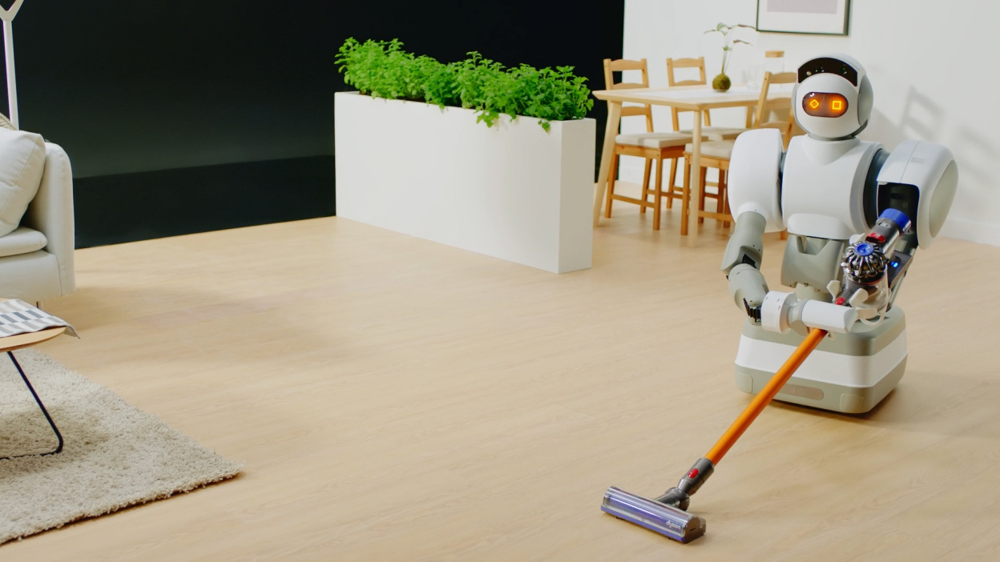

# Algorithme avancé - Classes et objets

Dans cet exercice, nous allons commencer à manipuler des `classes` et des `objets` pour mieux comprendre la notion de `POO` (`Programmation Orientée Objet`).

Pour cela, nous allons réaliser un petit exercice d’algorithmie qui va utiliser les classes et les objets pour nous simplifier le travail.

Dans cet exercice, nous allons incarner un `Robot` nettoyeur de maison :

Pour cela, nous allons réaliser un script qui va venir nettoyer notre maison de cette manière :

